# Heritage Housing - Predictive Analytics Project

This project aims to assist of house prices of  a client, who has inherited four houses in Ames, Iowa. The client seeks help in understanding what features influence house prices in the local market and needs a predictive model to estimate the sale prices of the inherited houses and any future property the customer may acquire in the region.

Visit the deployed site: [House-Price-Prediction-App](https://heritage-housing-ml-pgz-6ee988c2f095.herokuapp.com/)

---

## Table of Contents

- [Heritage Housing - Predictive Analytics Project](#heritage-housing---predictive-analytics-project)
  - [Table of Contents](#table-of-contents)
  - [Built With](#built-with)
  - [Introduction](#introduction)
  - [Dataset Content](#dataset-content)
  - [Business Requirements](#business-requirements)
  - [Project Organization](#project-organization)
    - [User Stories](#user-stories)
  - [Hypotheses](#hypotheses)
  - [CRISP-DM Methodology](#crisp-dm-methodology)
  - [Mapping Business Goals to ML \& Visualizations](#mapping-business-goals-to-ml--visualizations)
    - [Business Requirement 1: Identify Features that Influence Sale Price](#business-requirement-1-identify-features-that-influence-sale-price)
    - [Business Requirement 2: Predict Sale Prices of New Houses](#business-requirement-2-predict-sale-prices-of-new-houses)
    - [Dashboard Delivery](#dashboard-delivery)
  - [ML Business Case](#ml-business-case)
    - [Success Criteria](#success-criteria)
    - [Failure Conditions](#failure-conditions)
  - [Dashboard Design](#dashboard-design)
    - [Interactive Elements](#interactive-elements)
    - [Dashboard Pages Overview](#dashboard-pages-overview)
  - [Future Implementations](#future-implementations)
  - [**Testing**](#testing)
  - [Bugs and Limitations](#bugs-and-limitations)
    - [Known Bugs](#known-bugs)
    - [Limitations](#limitations)
  - [Deployment](#deployment)
    - [Heroku](#heroku)
      - [Instructions for deploying from GitHub to Heroku](#instructions-for-deploying-from-github-to-heroku)
    - [Local Machine](#local-machine)
  - [Libraries and Packages](#libraries-and-packages)
    - [Major Packages](#major-packages)
    - [Documentation Links](#documentation-links)
  - [Resources](#resources)
  - [Credits \& Acknowledgements](#credits--acknowledgements)
  - [Contact](#contact)

---

## Built With

 - [GitHub](https://github.com) – for version control and collaboration
 - [Jupyter Notebooks](https://jupyter.org) – for exploratory data analysis and model development
 - [Streamlit](https://streamlit.io) – for building the machine learning dashboard
 - [Heroku](https://www.heroku.com) – for deploying the application

## Introduction

This project addresses the challenge of predicting house sale prices in Ames, Iowa. It was developed to support a client who recently inherited four properties and needs to understand what drives property value and estimate realistic sale prices. The project uses a machine learning approach to build and evaluate regression models that can be used to price both the inherited homes and any future acquisitions.

The analysis is structured into a series of Jupyter notebooks that follow the full data science process:
1. **Data Collection** – Loads and explores the source dataset.
2. **Data Analysis** – Investigates variable distributions and relationships to `SalePrice`.
3. **Data Cleaning** – Handles missing values and prepares the data for modeling.
4. **Feature Engineering** – Encodes, transforms, and filters features for improved predictive power.
5. **Modeling and Evaluation** – Trains multiple models and evaluates performance, leading to final model selection.

To make the model accessible to the customer, a multi-page **Streamlit dashboard** was developed. This dashboard connects directly to the trained pipeline, allowing users to:
- Explore key features and visualizations
- Review model performance metrics
- Input new house data and receive real-time price predictions

This provides a transparent, interactive way for users to benefit from the model.


## Dataset Content

The dataset used for this project was sourced from Kaggle:

**Source**: [Kaggle – Housing Prices Data](https://www.kaggle.com/codeinstitute/housing-prices-data)

It contains records of residential properties sold in Ames, Iowa, along with various house features. Each row represents one house, and columns include numeric and categorical attributes such as living area, number of bedrooms, basement finish type, and more.

The target variable is:

- `SalePrice` – The final recorded sale price of the house (range: 34,900 to 755,000)

The dataset includes 24 features.The table below lists all features, with descriptions and available ranges or categories based on the provided metadata:

| Feature           | Description                                                  | Type         | Range / Categories                                      |
|-------------------|--------------------------------------------------------------|--------------|----------------------------------------------------------|
| `1stFlrSF`        | First floor square feet                                      | Numerical    | 334 – 4,692                                              |
| `2ndFlrSF`        | Second floor square feet                                     | Numerical    | 0 – 2,065                                                |
| `BedroomAbvGr`    | Bedrooms above ground (excludes basement bedrooms)           | Numerical    | 0 – 8                                                    |
| `BsmtExposure`    | Basement exposure (walkout or garden level walls)            | Categorical  | Gd, Av, Mn, No, None                                     |
| `BsmtFinType1`    | Rating of basement finished area                             | Categorical  | GLQ, ALQ, BLQ, Rec, LwQ, Unf, None                       |
| `BsmtFinSF1`      | Type 1 finished square feet in basement                      | Numerical    | 0 – 5,644                                                |
| `BsmtUnfSF`       | Unfinished square feet of basement area                      | Numerical    | 0 – 2,336                                                |
| `TotalBsmtSF`     | Total square feet of basement area                           | Numerical    | 0 – 6,110                                                |
| `GarageArea`      | Size of garage in square feet                                | Numerical    | 0 – 1,418                                                |
| `GarageFinish`    | Interior finish of the garage                                | Categorical  | Fin, RFn, Unf, None                                      |
| `GarageYrBlt`     | Year garage was built                                        | Numerical    | 1900 – 2010                                              |
| `GrLivArea`       | Above-ground (main floor) living area square feet            | Numerical    | 334 – 5,642                                              |
| `KitchenQual`     | Kitchen quality                                              | Ordinal      | Ex, Gd, TA, Fa, Po                                       |
| `LotArea`         | Lot size in square feet                                      | Numerical    | 1,300 – 215,245                                          |
| `LotFrontage`     | Linear feet of street connected to property                  | Numerical    | 21 – 313                                                 |
| `MasVnrArea`      | Masonry veneer area in square feet                           | Numerical    | 0 – 1,600                                                |
| `EnclosedPorch`   | Enclosed porch area in square feet                           | Numerical    | 0 – 286                                                  |
| `OpenPorchSF`     | Open porch area in square feet                               | Numerical    | 0 – 547                                                  |
| `OverallCond`     | Overall condition rating                                     | Ordinal      | 1 (Very Poor) to 10 (Very Excellent)                     |
| `OverallQual`     | Overall material and finish rating                           | Ordinal      | 1 (Very Poor) to 10 (Very Excellent)                     |
| `WoodDeckSF`      | Wood deck area in square feet                                | Numerical    | 0 – 736                                                  |
| `YearBuilt`       | Year the house was originally built                          | Numerical    | 1872 – 2010                                              |
| `YearRemodAdd`    | Year of remodeling (or same as `YearBuilt` if none)          | Numerical    | 1950 – 2010                                              |
| `SalePrice`       | Final sale price of the property (target variable)           | Numerical    | 34,900 – 755,000                                         

All preprocessing decisions and feature engineering steps were based directly on this data.


The feature descriptions and value ranges were derived from the accompanying metadata file:  
[house-metadata.txt](./inputs/datasets/raw/house-metadata.txt)


## Business Requirements

The client has inherited four houses in Ames, Iowa and is seeking support in understanding and predicting house sale prices. The business requirements for this project are:

1. **Identify price-driving features**  
   Understand which house attributes most influence sale prices through visual analysis and statistical correlation.

2. **Build a predictive model**  
   Develop a machine learning model that can estimate sale prices with reliable accuracy.

3. **Deliver an interactive tool**  
   Provide an easy-to-use dashboard where the client can input property features and receive price predictions.

4. **Ensure model performance**  
   The model should achieve an R² score of at least 0.75 on both training and test sets.

5. **Support future decision-making**  
   Enable the client to use the model for evaluating additional properties the customer may acquire.


## Project Organization

To manage and structure this project, a **Kanban-style GitHub Project board** was used. It allowed for clear tracking of tasks, milestones, and progress throughout development.

Project tasks / user stories were grouped into broader **epics (milestones)**:
1. **Data Collection and Understanding**
2. **Data Analysis and Insights**
3. **Machine Learning Model Development**
4. **Dashboard Development**
5. **Deployment**
6. **Documentation**

**Project Board**: [View GitHub Project](https://github.com/users/galindo89/projects/3)

### User Stories
The following user stories were defined to guide the implementation of features and ensure they aligned with business needs.

| User Story (Task)                                                               | Milestone                        |
|----------------------------------------------------------------------------------|----------------------------------|
| Test Streamlit APP                                                              | Dashboard Development            |
| Load and Explore the Dataset                                                    | Data Collection and Understanding|
| Clean and Preprocess the Data                                                   | Data Collection and Understanding|
| Train a Machine Learning Model                                                  | Machine Learning Model Development|
| Optimize the Model for Better Accuracy                                          | Machine Learning Model Development|
| Create and Maintain Jupyter Notebooks                                           | Documentation                    |
| Include a Technical Page for Model Performance                                  | Dashboard Development            |
| Deploy the App to a Cloud Platform                                              | Deployment                       |
| Build a User Interface for Predictions (#8)                                     | Dashboard Development            |
| Display Data Insights on the Dashboard                                          | Dashboard Development            |


## Hypotheses

At the start of the project, several general hypotheses were proposed to guide the direction of the analysis and modeling:

- **H1**: It is possible to build a regression model using the provided dataset that meets or exceeds the performance threshold defined in the business requirement (R² ≥ 0.75).
- **H2**: Certain house-related features—such as structural, quality, or condition attributes, may hold predictive value for estimating sale price.

## CRISP-DM Methodology

This project was structured following the CRISP-DM (Cross-Industry Standard Process for Data Mining) framework, which ensured a clear and iterative approach from problem understanding to deployment:

- **Business Understanding**: The project focused on delivering a predictive model that provides accurate and interpretable house price estimations for a client with inherited properties in Ames, Iowa.

- **Data Understanding**: Performed exploratory data analysis to identify key distributions, outliers, correlations, and the presence of missing data. Visualizations and statistical summaries helped uncover the structure of the dataset.

- **Data Preparation**: Developed a preprocessing pipeline that handled missing values, encoded categorical variables, applied transformations (e.g., log scaling), and dropped irrelevant features to prepare the data for modeling.

- **Modeling**: Multiple algorithms were tested, including Lasso Regression, Random Forest, and XGBoost. Hyperparameters were optimized using `GridSearchCV`, and modeling was conducted under reproducible conditions with fixed random states.

- **Evaluation**: Models were evaluated on both log-transformed and original target scales using metrics such as R², MAE, and RMSE. Performance consistency on both training and test sets was a core success metric.

- **Deployment**: The final XGBoost model was integrated into a Streamlit dashboard, providing the client with an interactive tool for analysis and real-time house price prediction.


## Mapping Business Goals to ML & Visualizations

To address the business requirements, we mapped each objective to appropriate machine learning tasks and supporting data visualizations:

### Business Requirement 1: Identify Features that Influence Sale Price

- **Approach**: Exploratory Data Analysis (EDA)  
- **Techniques Used**:
  - Distribution plots
  - Correlation heatmaps (Pearson and Spearman)
  - Predictive Power Score (PPS) matrix
  - Feature importance from trained models
- **Outcome**: Visual insights to help the client understand which house attributes are most relevant to price.

### Business Requirement 2: Predict Sale Prices of New Houses

- **Approach**: Supervised Regression Modeling  
- **ML Task**: Regression
- **Models Used**:
  - Lasso Regression
  - Random Forest Regressor
  - XGBoost Regressor (final selected model)
- **Outcome**: Trained pipeline capable of predicting sale prices with R² > 0.75.
  
For implementation details and evaluation results, refer to the [Modeling and Evaluation Notebook](./jupyter_notebooks/05%20-%20Modeling_Predict_SalePrice.ipynb).


### Dashboard Delivery

- **Visualization Tool**: Streamlit (interactive app)
- **Visual Outputs**:
  - Feature analysis dashboard (EDA + correlation plots)
  - Model performance page (R², RMSE, MAE, feature importance)
  - Prediction form for inputting house features and receiving price estimates
- **Outcome**: A self-contained dashboard to explore results and generate new predictions.

## ML Business Case

The goal of this project was to build a supervised regression model capable of predicting house sale prices based on property features. Multiple models were tested, including:

- **Lasso Regression**: A linear model with built-in feature selection.
- **Random Forest Regressor**: An ensemble method that handles non-linear relationships well.
- **XGBoost Regressor**: A gradient boosting algorithm known for strong performance on structured data.

After evaluation and hyperparameter tuning, **XGBoost** was selected as the final model due to its superior balance of accuracy and generalization.

### Success Criteria

To be considered successful, the model had to meet the following conditions:
- **R² Score ≥ 0.75** on both the training and test sets
- Reliable performance on unseen data with minimal overfitting

### Failure Conditions

The model would be considered inadequate if:
- R² on the test set dropped below 0.75
- The gap between training and test performance indicated significant overfitting
- Predictions lacked consistency or failed on back-transformed (original scale) evaluation

The final XGBoost model met all success criteria and was integrated into a dashboard for client use.


## Dashboard Design

The project includes an interactive Streamlit dashboard designed for both technical and non-technical users. The goal is to present the results of the analysis in a clear and actionable format, while also allowing for live prediction of house prices based on user input.

The dashboard was built to:
- Communicate the business context and modeling decisions
- Provide insights into key features and relationships
- Display model evaluation metrics
- Offer an interactive prediction form for new house data
- Support validation of early hypotheses

### Interactive Elements

- **Sidebar Navigation**: Navigate across app pages
- **Feature Plots**: Hoverable, interactive data visualizations
- **Prediction Form**: Input fields for entering house features
- **Prediction CSV File**: Allow users to upload a CSV file with house features for the model to predict the price
- **Prediction Output**: Displays predicted sale price using the trained XGBoost model
- **Hypothesis Checkboxes**: Used to validate assumptions interactively 

### Dashboard Pages Overview

| Page Name                   | Description                                                                 | Screenshot |
|-----------------------------|-----------------------------------------------------------------------------|------------|
| **Project Summary**         | Introduces the business case, project goals, and approach.                 | 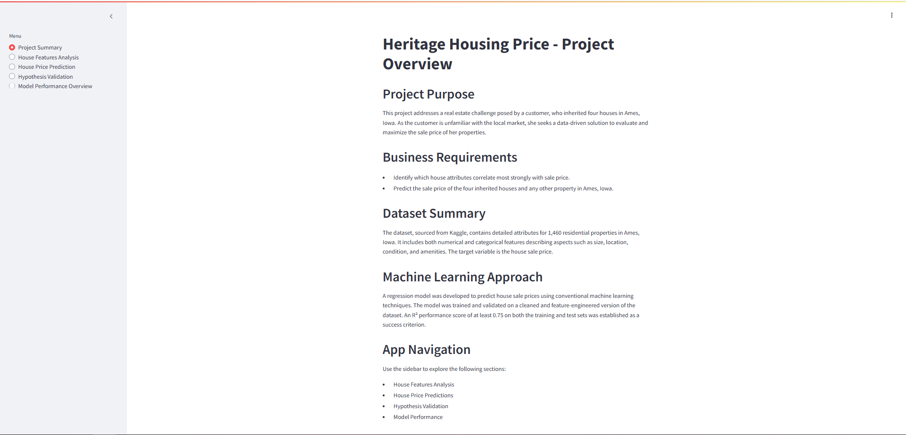 |
| **House Features Analysis** | Interactive plots showing key feature relationships with `SalePrice`.     | 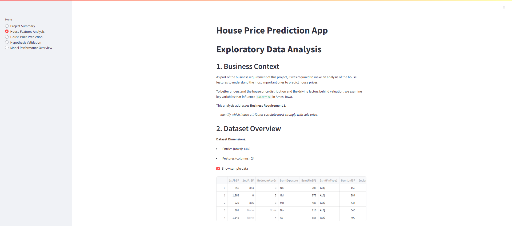 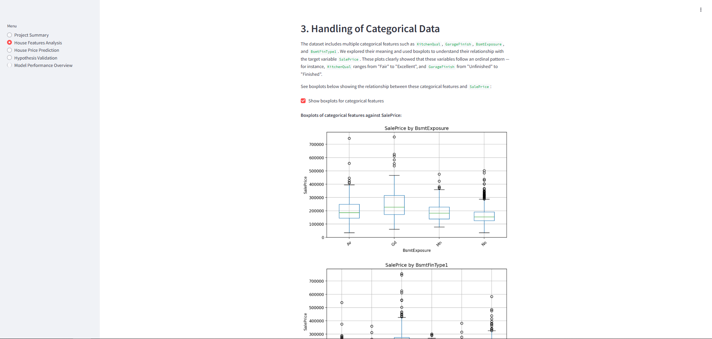 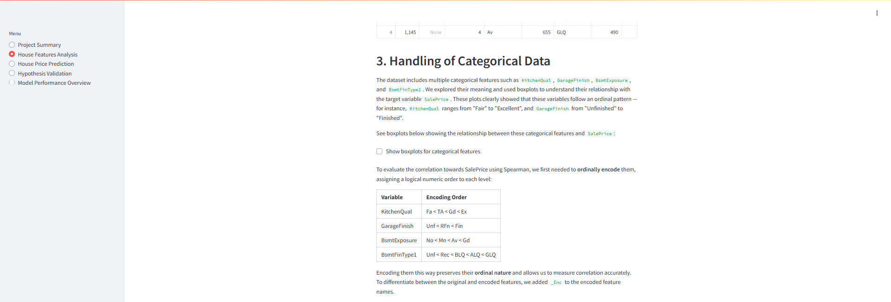 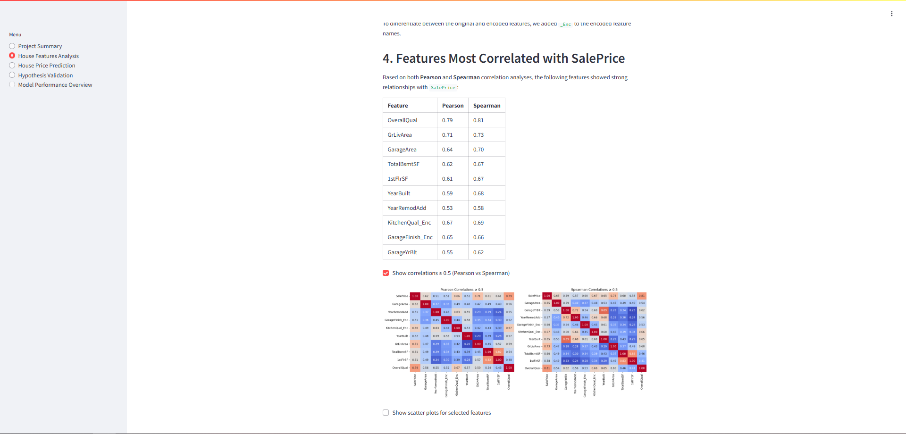 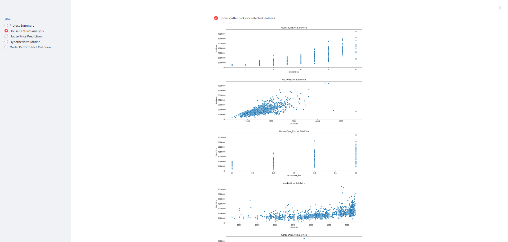 |
| **House Price Prediction**  | User form to input house features and get predicted sale price.            | 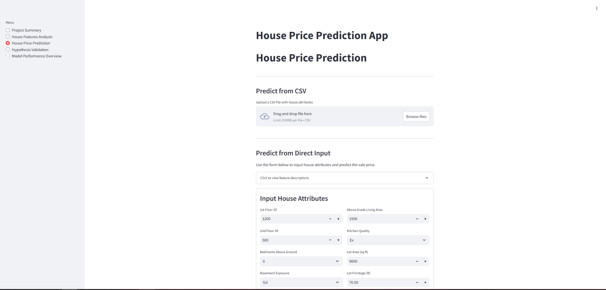 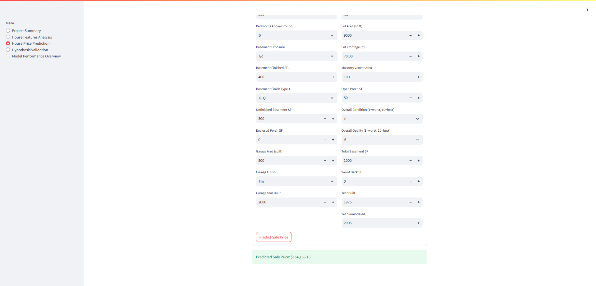 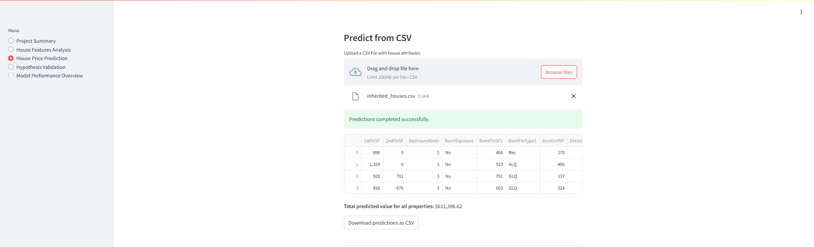|
| **Hypothesis Validation**   | Presents hypotheses and their outcomes based on data.                      | 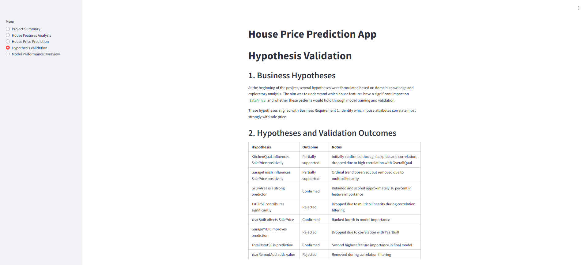 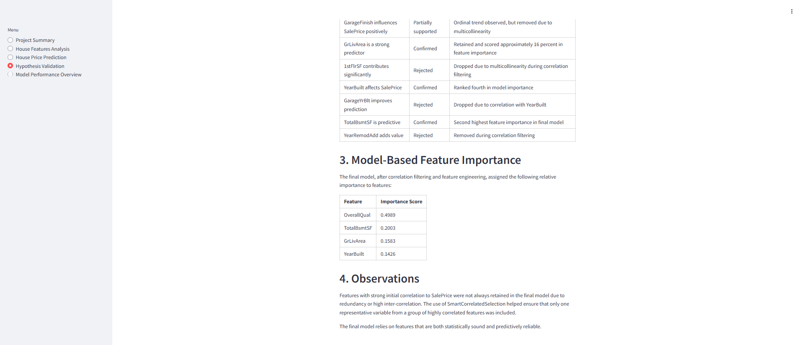|
| **Model Performance Overview** | Shows model evaluation metrics and feature importance.                 | 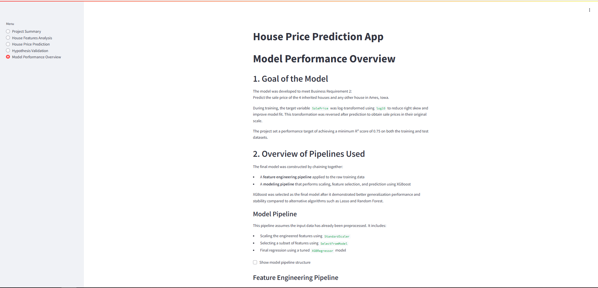 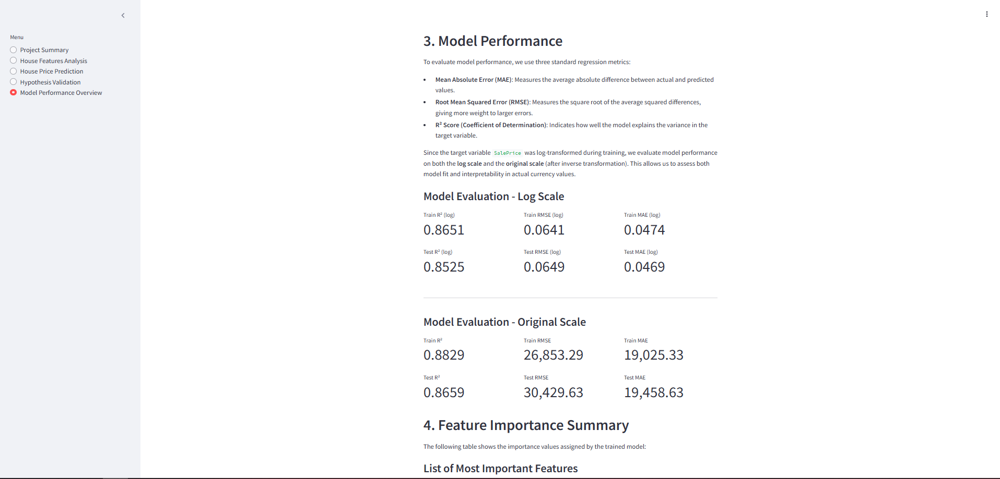 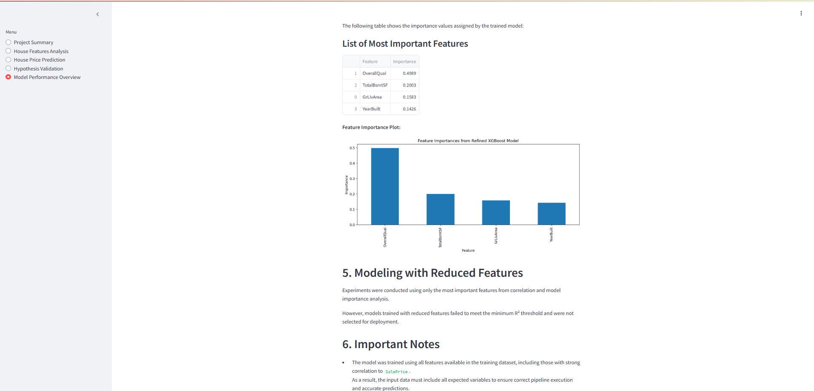|

## Future Implementations

1. **Reduce Feature Dependency** 
   Optimize the model to require fewer input features while maintaining predictive accuracy. This would simplify the user interface and make the model easier to use with limited data availability.

2. **API Integration**  
   Expose the trained model via a REST API to allow external applications or services to access predictions programmatically. This would support integration with other platforms or mobile apps.

3. **User Feedback Loop**
   
    Add functionality for users to flag inaccurate predictions or submit new data, which could be used for model retraining.
  

## **Testing**
- Comprehensive testing was conducted to ensure functionality across devices and browsers.
- Testing included:
  - Code Validation
  - Manual Testing
  
For a detailed overview of the testing process, including test scenarios, results, and methodologies, please refer to the [TEST.md](TEST.md) file.

## Bugs and Limitations

### Known Bugs
- There are no known bugs in the application after deployment.

### Limitations
- The CSV file upload feature does not currently validate if values are negative or out of realistic range.
- The prediction tool requires users to input values for all house features. Partial input is not supported.

## Deployment

### Heroku

- Heroku live link: [House-Price-Prediction-App](https://heritage-housing-ml-pgz-6ee988c2f095.herokuapp.com/)

#### Instructions for deploying from GitHub to Heroku

1. Ensure the repository includes the following required files:
   - `requirements.txt`
   - `Procfile`
   - `setup.sh`
   - `runtime.txt`

2. Push all code to GitHub.

3. Log in to [Heroku](https://dashboard.heroku.com/) and create a new app.

4. Under the "Deploy" tab, select "GitHub" as the deployment method and connect your GitHub account.

5. Search for your repository and connect it to the Heroku app.

6. Under the "Deploy" tab, click "Deploy Branch".

7. Once the build is complete, click "Open App" to view the deployed application.


### Local Machine

Clone this repository  
Open Repo in your IDE (VS Code or GitPod, etc)  
Ensure virtual environment is set up:
```
python3 -m venv .venv
```

Activate the virtual environment:
```
source .venv/bin/activate  # On Windows use: .venv\Scripts\activate
```

Install requirements_dev.txt:
```
pip install -r requirements_dev.txt
```

To View the Dashboard on local machine in CLI type:
```
streamlit run app.py
```
and click "open browser"

In the Jupyter notebooks, select the Python kernel before running cells  

(The requirements.txt file does not contain development libraries and is only for deployment to heroku)

## Libraries and Packages

### Major Packages

The project makes use of the following major Python packages:

- pandas
- numpy
- scikit-learn
- streamlit
- matplotlib
- seaborn
- plotly
- joblib

### Documentation Links

- [pandas documentation](https://pandas.pydata.org/docs/)
- [scikit-learn documentation](https://scikit-learn.org/stable/documentation.html)
- [streamlit documentation](https://docs.streamlit.io/)
- [matplotlib documentation](https://matplotlib.org/stable/contents.html)
- [seaborn documentation](https://seaborn.pydata.org/)
- [plotly documentation](https://plotly.com/python/)

## Resources

- Dataset used in this project: [Ames Housing Dataset on Kaggle](https://www.kaggle.com/codeinstitute/housing-prices-data)
- This project was developed as part of the Code Institute Predictive Analytics program.
- The implementation was based on original work but inspired by best practices introduced in Code Institute's walkthroughs.
- Additional helpful resources:
  - [Scikit-learn User Guide](https://scikit-learn.org/stable/user_guide.html)
  - [Towards Data Science: Feature Engineering Techniques](https://towardsdatascience.com/feature-engineering-for-machine-learning-3a5e293a5114)
  - [Streamlit App Gallery](https://streamlit.io/gallery)


## Credits & Acknowledgements

- Thanks to my mentor Rohit Sharma for the continuous guidance and constructive feedback throughout the project.
- Appreciation to the Code Institute community on Slack for support and discussions.
- Helpful insights and troubleshooting from peers during project development.
- Stack Overflow, GitHub discussions, and official documentation were instrumental in solving technical challenges.

## Contact
For more information, please contact [pablo.galindozapata@gmail.com].