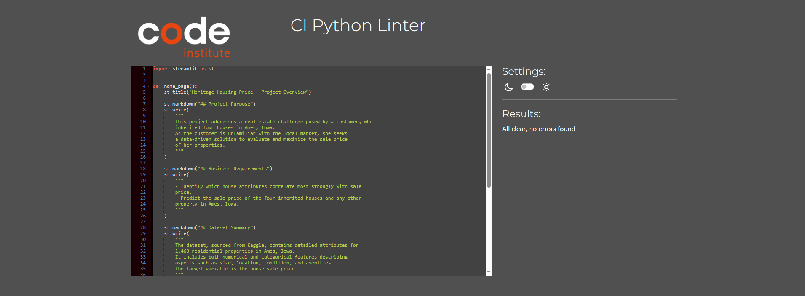
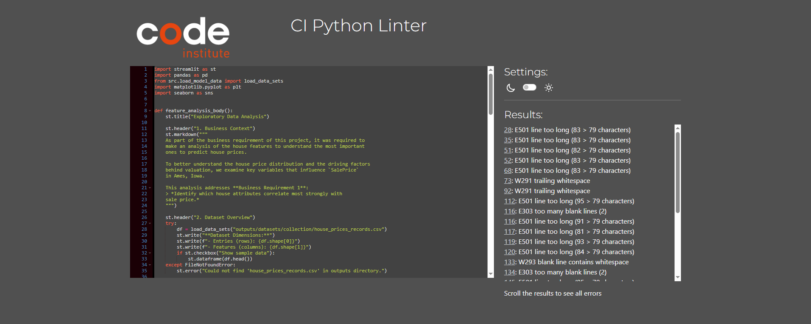
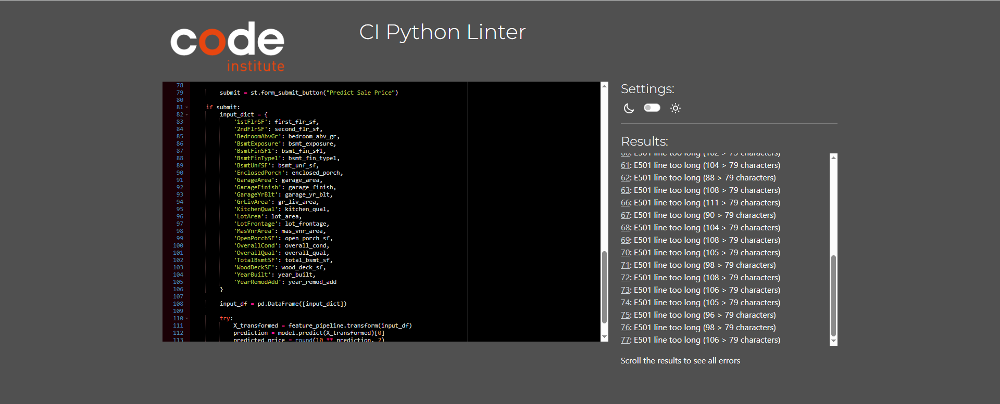
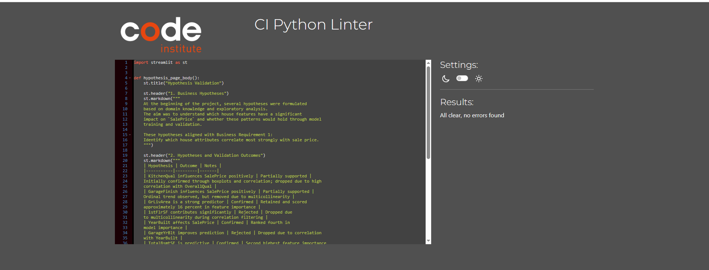
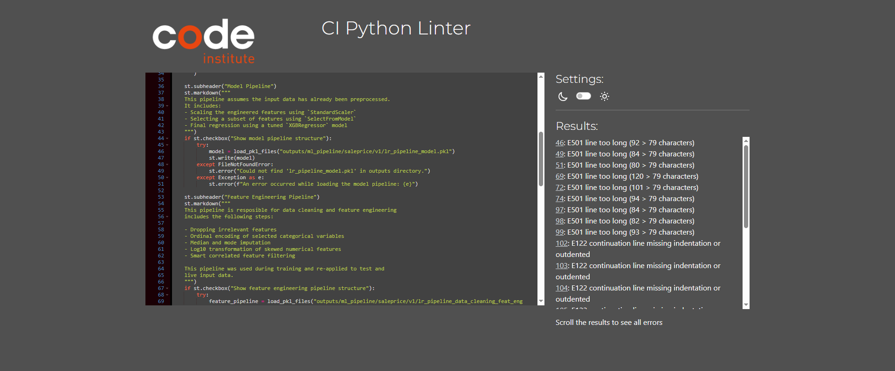
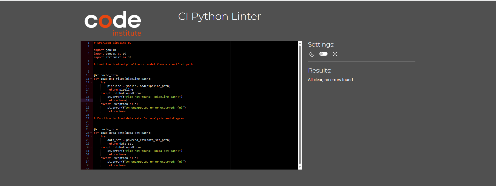
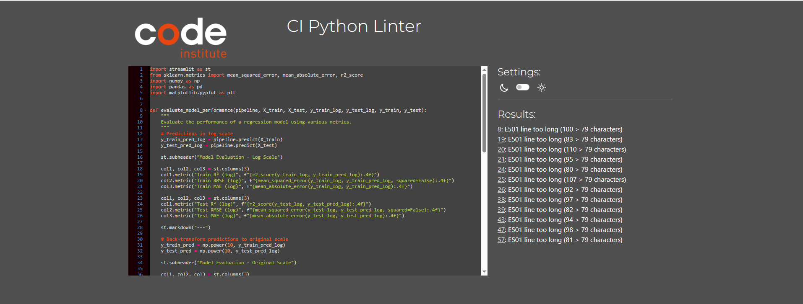
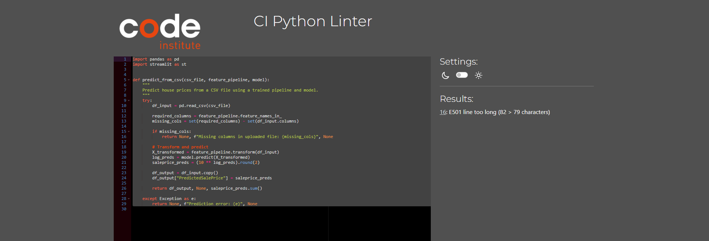
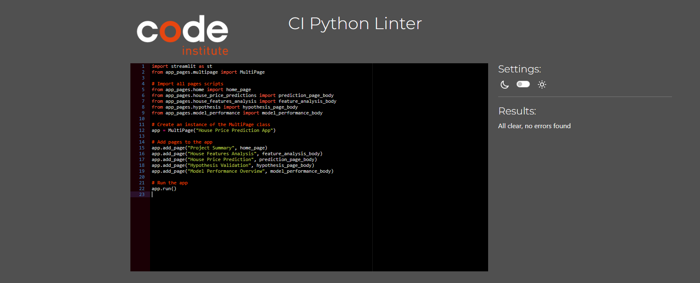

# TESTING DOCUMENTATION

This document contains a detailed overview of all testing conducted during the development of the project.

---

## Table of Contents

- [TESTING DOCUMENTATION](#testing-documentation)
  - [Table of Contents](#table-of-contents)
  - [Overview](#overview)
  - [Code Validation](#code-validation)
    - [**Python**](#python)
  - [Manual Testing](#manual-testing)
    - [Jupyter Notebooks](#jupyter-notebooks)
    - [Streamlit Dashboard](#streamlit-dashboard)
  - [Browser and Device Compatibility](#browser-and-device-compatibility)
  - [Testing Tools Used](#testing-tools-used)

---

## Overview

Comprehensive testing was conducted to ensure functionality across devices, pages, and environments.  
Testing included:

- Code validation (PEP8)
- Manual testing of all app components
- Dashboard responsiveness and logic validation
- Browser/device compatibility checks

---

## Code Validation
### **Python**
Python validation was conducted using [PEP8 Linter](https://pep8ci.herokuapp.com/) to ensure compliance with Python coding standards. Below is the summary of the validation results:

Validation results and screenshots

| Page / Feature                 | Result           | Comment                                                                                                                                                           | Screenshot |
|-------------------------------|------------------|-------------------------------------------------------------------------------------------------------------------------------------------------------------------|------------|
| Page Summary                  | Passed           |                                                                                                   |  |
| House Features Analysis       | Partially Passed | Several lines exceeded the recommended PEP8 line length limit. However, this was mainly due to Python's indentation and long function arguments. All other issues and potential errors were identified and corrected. |  |
| House Price Predictions       | Partially Passed | Several lines exceeded the recommended PEP8 line length limit. However, this was mainly due to Python's indentation and long function arguments. All other issues and potential errors were identified and corrected. |  |
| Hypothesis Validation         | Passed           |                                                                                                   |  |
| Model Performance             | Partially Passed | Several lines exceeded the recommended PEP8 line length limit. However, this was mainly due to Python's indentation and long function arguments. All other issues and potential errors were identified and corrected. |  |
| load_model_data               | Passed           |                                                                                                   |  |
| model_performance_evaluator  | Partially Passed | Several lines exceeded the recommended PEP8 line length limit. However, this was mainly due to Python's indentation and long function arguments. All other issues and potential errors were identified and corrected. |  |
| predict_csv.py                | Partially Passed | Several lines exceeded the recommended PEP8 line length limit. However, this was mainly due to Python's indentation and long function arguments. All other issues and potential errors were identified and corrected. |  |
| app.py                | Passed | | |

---

## Manual Testing

### Jupyter Notebooks

| Notebook | Description | Status |
|----------|-------------|--------|
| Data Collection | Dataset loading and structure checks |Passed |
| Data Analysis | Visuals rendered and variables assessed | Passed |
| Data Cleaning | Imputation and transformations applied | Passed |
| Feature Engineering | Encodings, transformations, and filtering | Passed |
| Modeling & Evaluation | Model training and scoring verified | Passed |

### Streamlit Dashboard

| Page | Test Action | Result |
|------|-------------|--------|
| Project Summary | Page loads and renders correctly | Passed|
| Feature Analysis | Plots load and update as expected | Passed |
| Model Performance | Metrics and visual content render correctly | Passed |
| Prediction Form | Form submits and returns price prediction | Passed |
| Hypothesis Validation | Hypothesis content loads as expected | PAssed |

---

## Browser and Device Compatibility

The dashboard was tested on the following environments:

| Device | Browser | Status |
|--------|---------|--------|
| Desktop | Chrome | Passed |
| Desktop | Firefox | Passed |
| Android | Chrome | Passed |
| iPad | Safari | Passed |

---

## Testing Tools Used

- [PEP8 Linter](https://pep8ci.herokuapp.com/)
- Jupyter Notebook / Streamlit testing in-browser
- Manual testing on Chrome, Firefox, Safari
